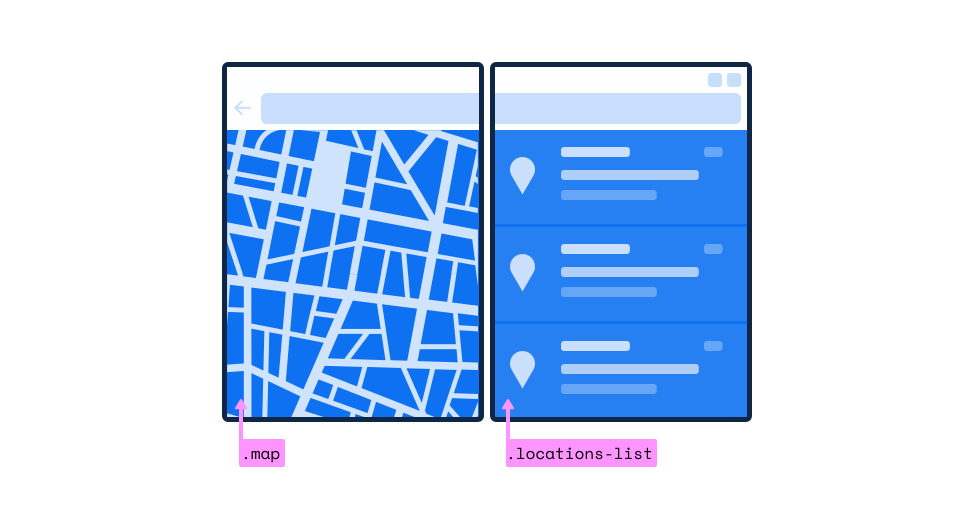

CSS Foldable Display polyfills
===

This is a polyfill for the [proposed](https://github.com/MicrosoftEdge/MSEdgeExplainers/blob/master/Foldables/explainer.md) CSS Foldable Display extensions.

Web developers targeting foldable devices want to be able to effectively lay out the content in a window that spans multiple displays. CSS Foldable Display
extensions provides a mean to do that using stylesheets.

### The 'spanning' CSS media feature

The `spanning` CSS media feature can be used to test whether the browser window is spanning across multiple diplays.


#### Syntax

The `spanning` media feature value can be one of the following keywords:

- **single-fold-vertical**

This value matches when the layout viewport is spanning a single fold (two screens) and the fold posture is vertical.

- **single-fold-horizontal**

This value matches when the layout viewport is spanning a single fold (two screens) and the fold posture is horizontal.

- **none**

This value describes the state of when the browser window is not in spanning mode.

#### Example

A map application that presents a map on one window segment and search results on another



```css
@media (spanning: single-fold-vertical) {
  body {
    flex-direction: row;
  }

  .map {
    flex: 1 1 env(fold-left)
  }

  .locations-list {
    flex: 1;
  }
}
```

### Device fold CSS environment variables

There are 4 pre-defined CSS environment variables, which can be used to calculate each screen segment size at both landscape and portrait orientations.

- **fold-top**
- **fold-left**
- **fold-width**
- **fold-height**


While the spanning media query guarantees there is only a single hinge and two screen segments, developers must not take a dependency that each screen segment is 50% of the viewport height or width, as that may not always be the case.

The values of these variables are CSS pixels, and are relative to the layout viewport (i.e. are in the [client coordinates, as defined by CSSOM Views](https://drafts.csswg.org/cssom-view/#dom-mouseevent-clientx)).

When evaluated while not in one of the spanning states, these values will be treated as if they don't exist, and use the fallback value as passed to the `env()` function.


How to use the polyfill
===

Add the polyfill to your project

```html
<script src="spanning-css-polyfill.js"></script>
```

and start using the new CSS features.

- That's it. See the `demo/` directory for examples.

In order to change the display configuration, you can use the polyfill together with an emulator or you can change the settings manually. The settings are stored across sessions.

#### Manually changing the display configuration

The configuration object is available as

```js
  const config = window["__foldables_env_vars__"];
```

You can update values such as `spanning`, `foldSize` and `browserShellSize` by calling the `update` method:

```js
  config.update({
    spanning: "single-fold-horizontal",
    foldSize: 30,
    browserShellSize: 20
  });
```

Test suite
===

There are unfortunately no [web-platform-tests](https://github.com/w3c/web-platform-tests/) available yet.

Known issues
===

Check GitHub.

Learn more
===

- [Explainer](https://github.com/MicrosoftEdge/MSEdgeExplainers/blob/master/Foldables/explainer.md) - a document explaining how this feature was designed and how it fits together with other APIs.